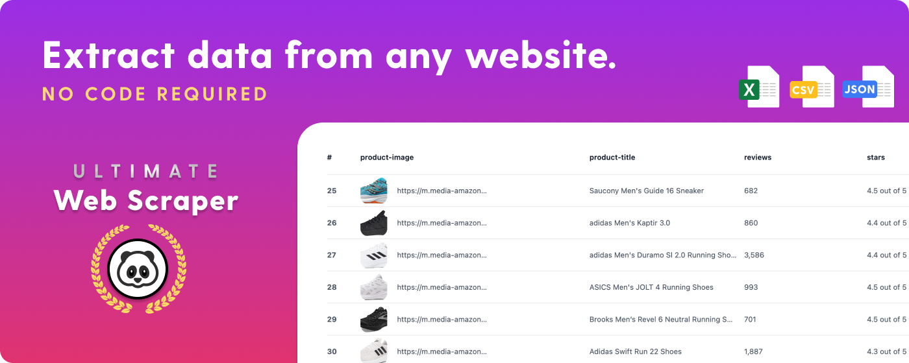
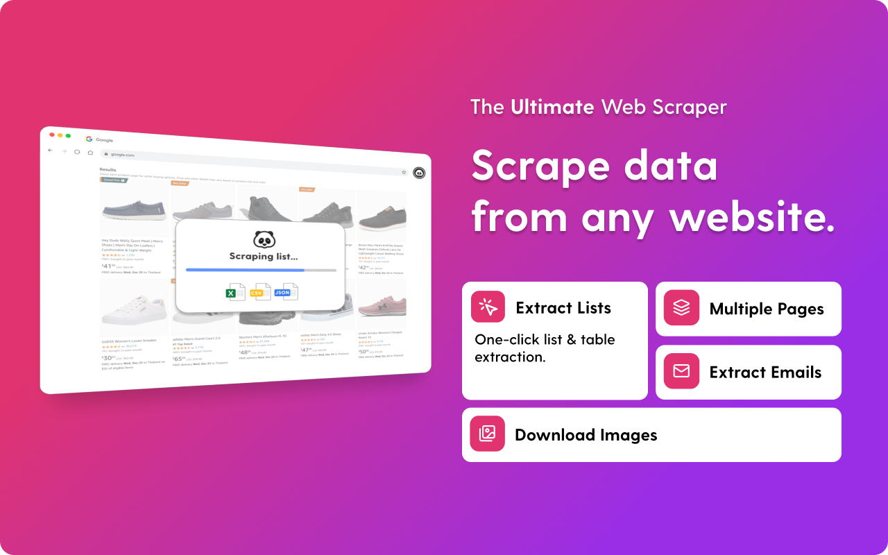
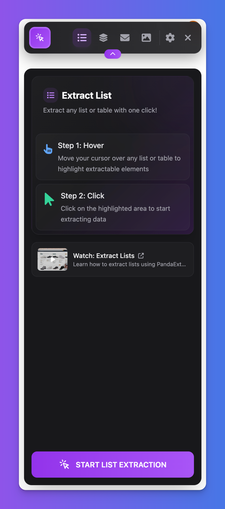
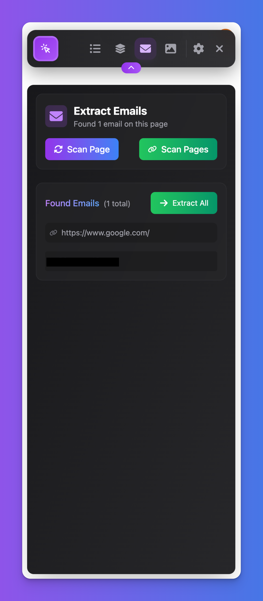
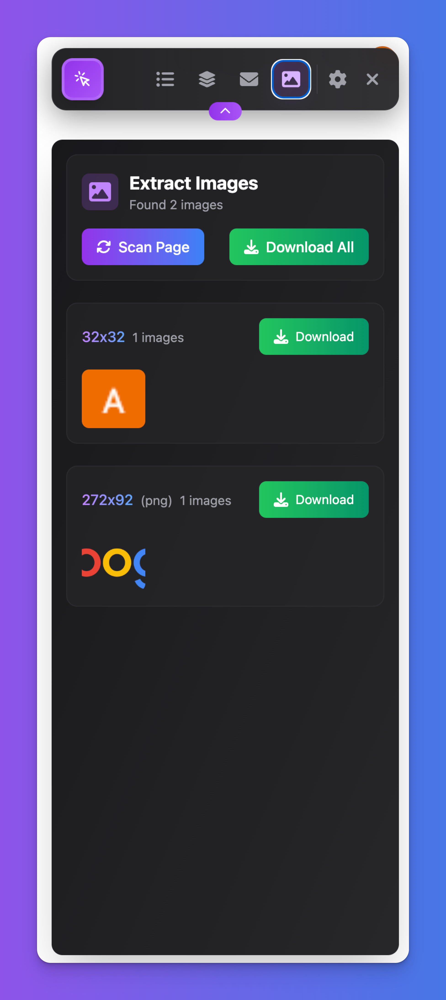
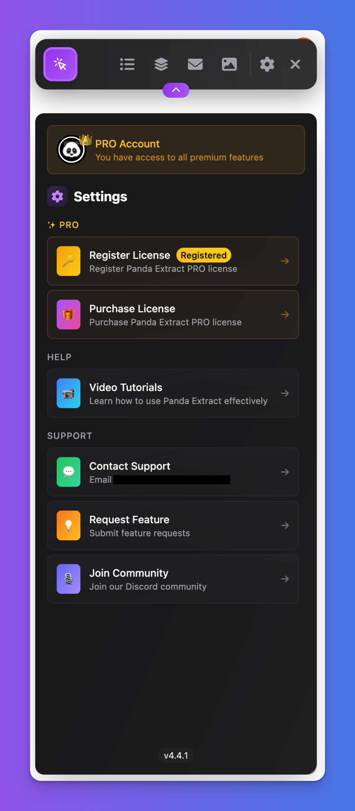
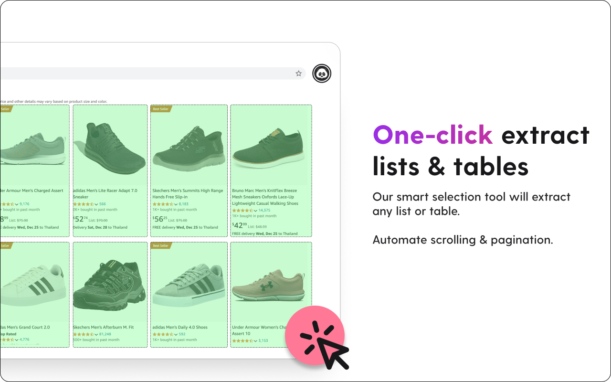
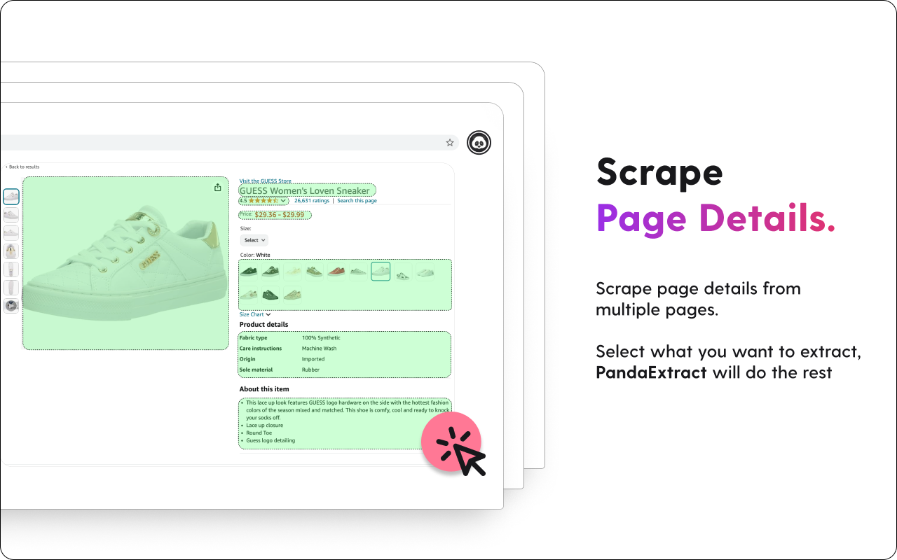
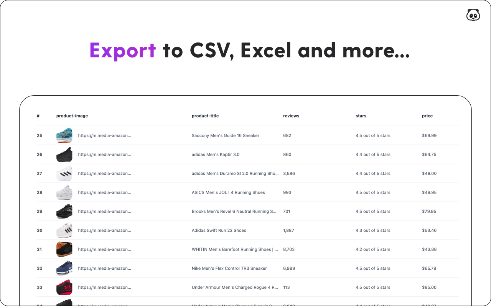

# Ultimate Web Scraper 

A powerful, AI-driven web scraper that helps businesses and individuals extract data from any website without coding. Perfect for lead generation, market research, and data analysis.

PandaExtract is a powerful, user-friendly web scraper that enables you to extract data from any website with just a few clicks. No coding skills required!

## 🚀 Key Features

- **One-Click Extraction**: Instantly scrape lists, tables, and other structured data
- **Smart Pagination**: Automatically handles infinite scrolling and pagination
- **AI-Powered Extraction**: Superior accuracy in data collection
- **Multi-Purpose Scraping**:
  - 📧 Email addresses
  - 📞 Phone numbers
  - 🏢 Business details
  - 👤 Contact information
  - ⭐ Reviews and ratings
  - 🖼️ Images and media
  - 🌐 Social media profiles

## ⭐ Powerful Features in Action

| 📋 List Extraction                                                   | 📧 Email Scraping                                                   |
| -------------------------------------------------------------------- | ------------------------------------------------------------------- |
|    |  |
| **🖼️ Image Downloads**                                               | **⚙️ Customizable Settings**                                        |
|  |      |

## 💼 Perfect For

- **B2B Marketers**: Generate quality leads with complete contact information
- **Sales Teams**: Build comprehensive prospect lists
- **Researchers**: Gather large datasets for analysis
- **Recruiters**: Extract candidate details
- **E-commerce**: Monitor products and pricing
- **Real Estate**: Track property listings
- **Digital Marketing**: Collect market intelligence

## 🎯 Popular Use Cases

- Trustpilot Reviews Extraction
- Twitter/X Data Collection
- Airbnb Listings Scraping
- Shopify Products Data
- Zillow Real Estate Information
- Etsy Product Details
- Amazon Product Research
- Google Maps Business Data

## 📊 Export Options

- CSV
- Excel
- Google Sheets
- Custom formats

## 🔒 Privacy & Security

- Client-side processing
- Secure data handling
- No data storage on servers
- Works behind login pages

## 🌟 Why Choose PandaExtract?

1. No coding required
2. Lightning-fast extraction
3. Automatic data labeling
4. Supports all major websites
5. Regular updates and improvements
6. Active community support

## 🔗 Quick Links

- [Chrome Web Store](https://chromewebstore.google.com/detail/ultimate-web-scraper/pdeldjlcnhallaapdggcmhpailpnnkmg)
- [Official Website](https://pandaextract.com/)
- [Support Documentation](https://pandaextract.com/support)
- [Blog](https://pandaextract.com/blog)
- [Changelog](https://pandaextract.com/changelog)

## 🛠️ Free Tools

- [Email Scraper](https://pandaextract.com/tools/email-scraper)
- [Google Maps Scraper](https://pandaextract.com/tools/google-maps-scraper)
- [Website to Text Converter](https://pandaextract.com/tools/website-to-text)
- [Phone Number Extractor](https://pandaextract.com/tools/phone-number-extractor)
- [Trustpilot Scraper](https://pandaextract.com/tools/trustpilot-scraper)

## 📱 Connect With Us

- [Twitter](https://x.com/pandaextractapp)
- [LinkedIn](https://www.linkedin.com/company/panda-extract)
- [Facebook](https://www.facebook.com/pandaextract)
- [YouTube](https://www.youtube.com/@PandaExtractVisualScraper)
- [Reddit](https://www.reddit.com/r/PandaExtract/)
- [Instagram](https://www.instagram.com/getpandaextract/)

## ⚡ Get Started Now

Transform your data collection process today with PandaExtract - the ultimate web scraper that makes data extraction simple, fast, and efficient!

## 📫 Support

Need help? Contact us at support@pandaextract.com

## 💬 What Users Say About Our Web Scraper

"The best web scraper I've used for lead generation" - Marketing Director
"Most reliable web scraper for e-commerce research" - Business Analyst
"Simplest web scraper for non-technical users" - Small Business Owner

## Why PandaExtract is the Best Web Scraper for 2024

## Web Scraper Features That Save You Time

## Web Scraper Use Cases & Success Stories

## 🔄 Web Scraper Comparison

| Feature           | PandaExtract Web Scraper | Traditional Web Scrapers |
| ----------------- | ------------------------ | ------------------------ |
| Setup Time        | Instant                  | Hours/Days               |
| Coding Required   | No                       | Yes                      |
| Learning Curve    | Minimal                  | Steep                    |
| Automatic Updates | Yes                      | Often Manual             |
| AI-Powered        | Yes                      | Rarely                   |

---

© 2024 Panda Tech, Inc. All rights reserved.
