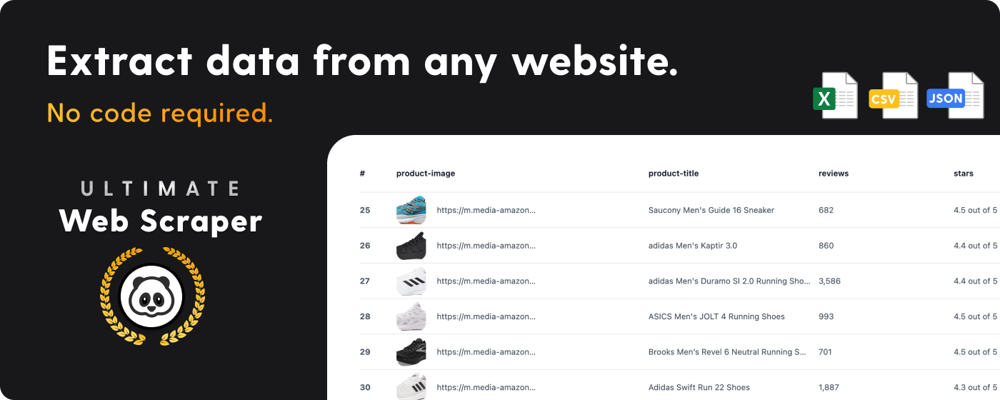
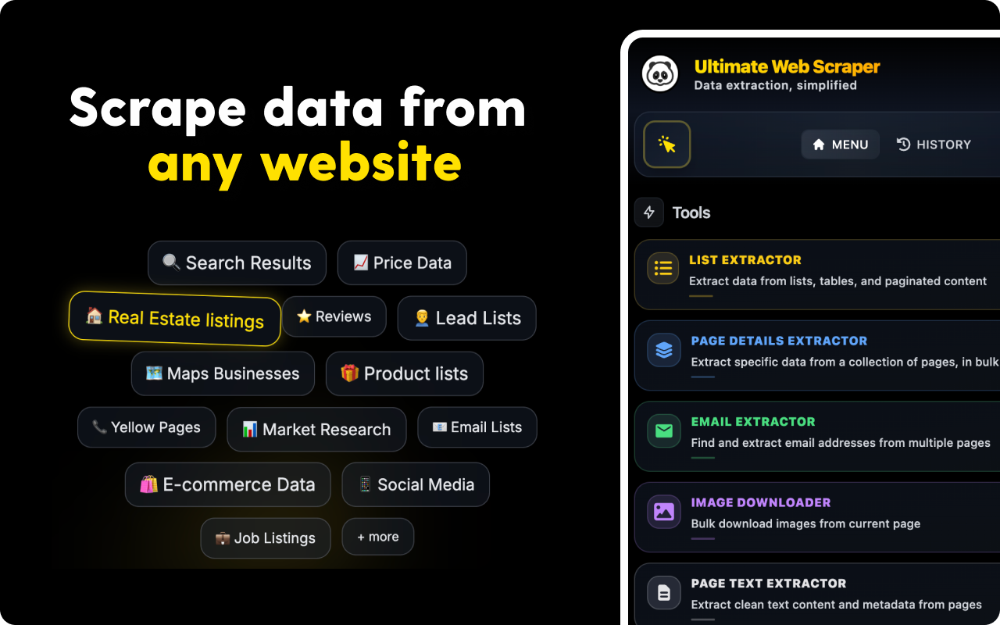
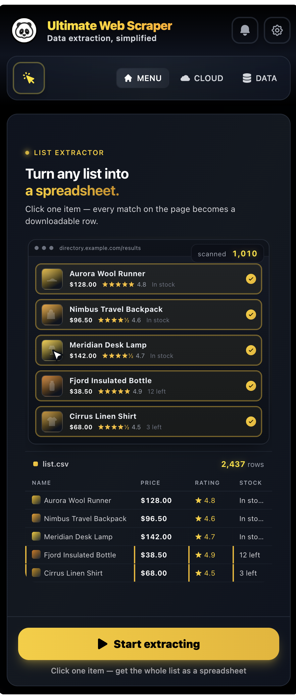
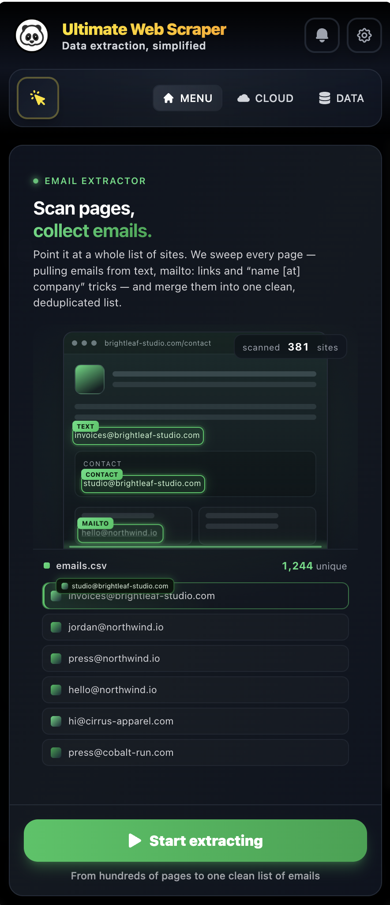
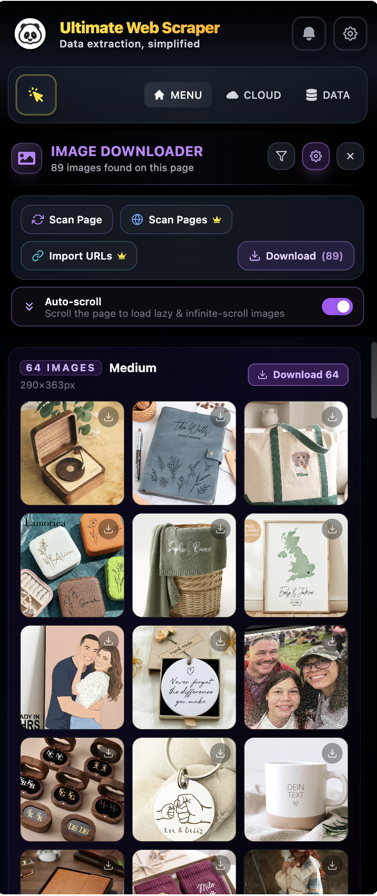
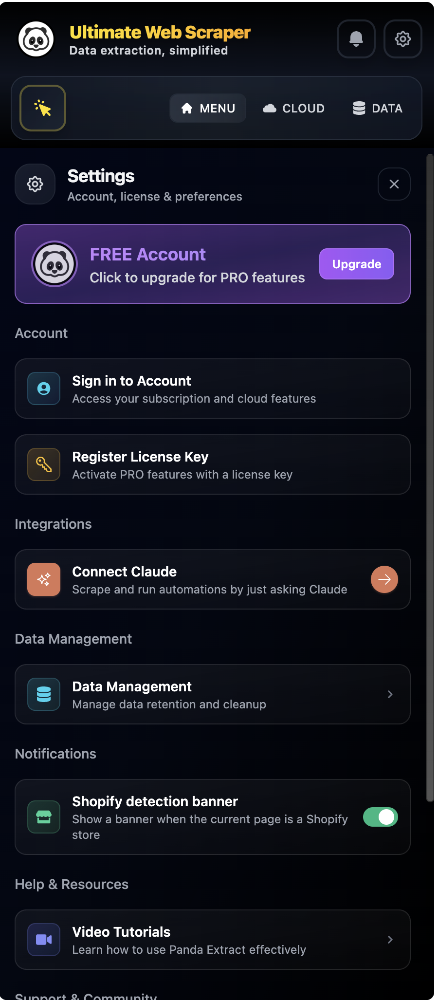
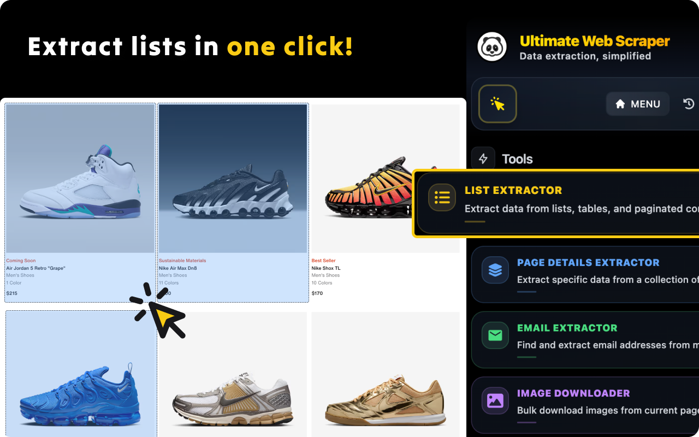
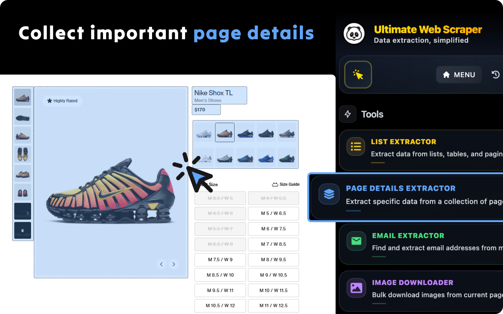
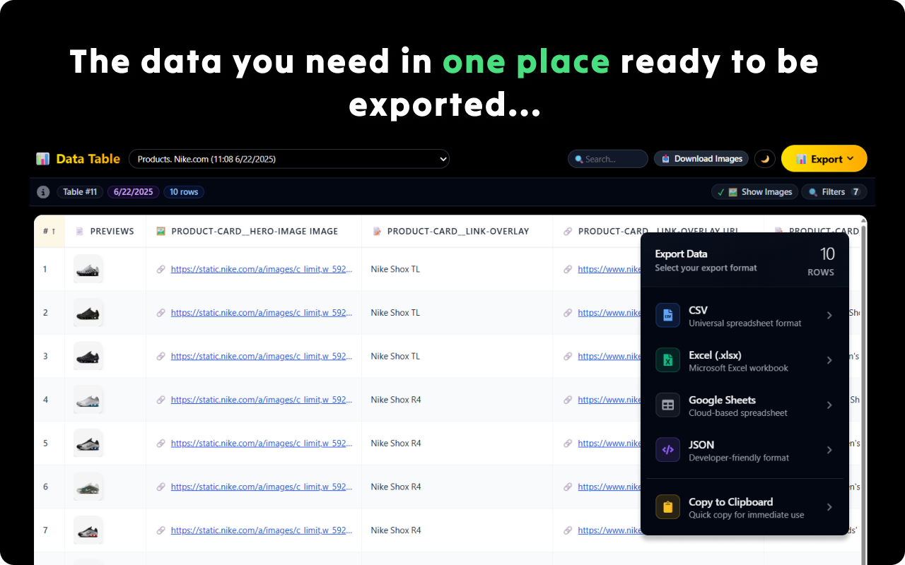

# Ultimate Web Scraper — AI Web Scraper & No-Code Chrome Extension (MCP for Claude)

Ultimate Web Scraper is a powerful, AI-driven web scraper that helps businesses and individuals extract data from any website without coding. Connect it to **Claude and other AI agents over MCP** (Model Context Protocol) to scrape, clean, and analyze data in plain language. Perfect for lead generation, market research, e-commerce data, and AI-powered data extraction.

Ultimate Web Scraper (formerly PandaExtract) is a powerful, user-friendly web scraper that lets you extract data from any website with just a few clicks — no coding skills required. Run it locally as a Chrome extension, in the cloud at scale, or through **AI agents like Claude** connected over MCP.

## 🚀 Key Features

- **One-Click Extraction**: Instantly scrape lists, tables, and other structured data
- **Smart Pagination**: Automatically handles infinite scrolling and pagination
- **AI-Powered Extraction**: Superior accuracy in data collection
- **AI Agents & MCP**: Connect Claude, Claude Code, Cursor, and other MCP clients to your cloud workspace
- **Cloud Scraping**: Run extractions in cloud browsers with proxies and anti-blocking — no computer needed
- **Multi-Purpose Scraping**:
  - 📧 Email addresses
  - 📞 Phone numbers
  - 🏢 Business details
  - 👤 Contact information
  - ⭐ Reviews and ratings
  - 🖼️ Images and media
  - 🌐 Social media profiles
  - 🛍️ Shopify products and catalogs

## 🤖 AI Web Scraper with MCP — Built for Claude

Ultimate Web Scraper **speaks MCP** (Model Context Protocol) — the open standard that lets AI assistants connect to your tools. Connect your cloud workspace to Claude and other AI agents, then scrape and work with your data conversationally:

- 🔌 **Connect Claude** (web and desktop) with a guided setup, plus access tokens for **Claude Code**, **Cursor**, and any MCP-compatible client
- 💬 **Chat with your data**: *"Which of the 2,000 companies I scraped don't have an email?"* or *"Clean up this table and merge the address columns."*
- 🪄 **AI-started extractions**: ask your assistant to extract product data, emails, social links, phone numbers, or Google Maps places
- ⚙️ **Operate automations**: re-run a price-monitoring or lead-gen scrape and get told when it's done — all in natural language
- 🛡️ **Workspace-scoped and secure**: read-only or full-access tokens, revocable anytime; agents only ever see your cloud data

AI connections are **rolling out now** for cloud workspaces. → [Connect an AI agent (MCP)](https://ultimatewebscraper.com/docs/ai/connect) · [AI Agents & MCP overview](https://ultimatewebscraper.com/docs/ai)

## ⭐ Powerful Features in Action

| 📋 List Extraction                                                   | 📧 Email Scraping                                                   |
| -------------------------------------------------------------------- | ------------------------------------------------------------------- |
|    |  |
| **🖼️ Image Downloads**                                               | **⚙️ Customizable Settings**                                        |
|  |      |

## 💼 Perfect For

- **B2B Marketers**: Generate quality leads with complete contact information
- **Sales Teams**: Build comprehensive prospect lists
- **Researchers**: Gather large datasets for analysis
- **Recruiters**: Extract candidate details
- **E-commerce**: Monitor products and pricing
- **Real Estate**: Track property listings
- **Digital Marketing**: Collect market intelligence
- **AI & Automation Builders**: Feed live web data into Claude and other AI agents via MCP

## 🎯 Popular Use Cases

- AI Web Scraping with Claude (MCP)
- Trustpilot Reviews Extraction
- Twitter/X Data Collection
- Shopify Products & Catalog Data
- Google Maps Business Data
- Yelp Reviews Scraping
- Job Board Listings Scraping
- Instagram Image Downloads
- Website to Text Conversion (for LLMs and AI)

## 📊 Export Options

- CSV
- Excel
- Google Sheets
- Query and export straight from an AI agent over MCP

## 🔒 Privacy & Security

- Local-first: extension runs in your logged-in browser and keeps data on your machine
- AI agents connect to your **cloud** workspace only — local data is never exposed
- Workspace-scoped, revocable access tokens for every MCP client
- Works behind login pages

## 🌟 Why Choose Ultimate Web Scraper?

1. No coding required
2. Lightning-fast extraction
3. AI-native: connect Claude and other agents over MCP
4. Automatic data labeling
5. Supports all major websites
6. Runs locally, in the cloud, or from your AI assistant
7. Regular updates and active community support

## 🔗 Quick Links

- [Chrome Web Store](https://chromewebstore.google.com/detail/ultimate-web-scraper/pdeldjlcnhallaapdggcmhpailpnnkmg)
- [Official Website](https://ultimatewebscraper.com/)
- [AI Agents & MCP (Claude)](https://ultimatewebscraper.com/docs/ai)
- [Cloud Platform](https://ultimatewebscraper.com/cloud)
- [Documentation](https://ultimatewebscraper.com/docs)
- [Support](https://ultimatewebscraper.com/support)
- [Blog](https://ultimatewebscraper.com/blog)
- [Changelog](https://ultimatewebscraper.com/changelog)

## 🛠️ Free Tools

- [AI Web Scraper](https://ultimatewebscraper.com/tools/ai-web-scraper)
- [Email Scraper](https://ultimatewebscraper.com/tools/email-scraper)
- [Google Maps Scraper](https://ultimatewebscraper.com/tools/google-maps-scraper)
- [Shopify Product Extractor](https://ultimatewebscraper.com/tools/shopify-product-extractor)
- [Website to Text Converter](https://ultimatewebscraper.com/tools/website-to-text)
- [Phone Number Extractor](https://ultimatewebscraper.com/tools/phone-number-extractor)
- [Web Table Extractor](https://ultimatewebscraper.com/tools/web-table-extractor)
- [Sitemap URL Extractor](https://ultimatewebscraper.com/tools/sitemap-url-extractor)
- [Trustpilot Scraper](https://ultimatewebscraper.com/tools/trustpilot-scraper)
- [Yelp Scraper](https://ultimatewebscraper.com/tools/yelp-scraper)
- [Twitter/X Scraper](https://ultimatewebscraper.com/tools/twitter-scraper)

## 📱 Connect With Us

- [Twitter/X](https://x.com/ultimatescraper)
- [LinkedIn](https://www.linkedin.com/company/ultimatewebscraper)
- [Facebook](https://www.facebook.com/ultimatewebscraper)
- [YouTube](https://www.youtube.com/@UltimateWebScraper)
- [Reddit](https://www.reddit.com/r/ultimatewebscraper/)
- [Instagram](https://www.instagram.com/pandaextractapp/)

## ⚡ Get Started Now

Transform your data collection today with Ultimate Web Scraper — the AI web scraper that makes data extraction simple, fast, and connectable to Claude and any MCP agent.

## 📫 Support

Need help? Contact us at support@ultimatewebscraper.com

## 💬 What Users Say About Our Web Scraper

"The best web scraper I've used for lead generation" — Marketing Director
"Most reliable web scraper for e-commerce research" — Business Analyst
"Simplest web scraper for non-technical users" — Small Business Owner
"Connecting it to Claude over MCP changed how our team works with web data" — Automation Lead

## Why Ultimate Web Scraper Is the Best AI Web Scraper

## Web Scraper Features That Save You Time

## Web Scraper Use Cases & Success Stories

## 🔄 Web Scraper Comparison

| Feature             | Ultimate Web Scraper | Traditional Web Scrapers |
| ------------------- | -------------------- | ------------------------ |
| Setup Time          | Instant              | Hours/Days               |
| Coding Required     | No                   | Yes                      |
| Learning Curve      | Minimal              | Steep                    |
| Automatic Updates   | Yes                  | Often Manual             |
| AI-Powered          | Yes                  | Rarely                   |
| AI Agents & MCP     | Yes (Claude & more)  | No                       |
| Cloud Scraping      | Yes                  | Varies                   |

---

© 2026 Panda Tech, Inc. All rights reserved.
